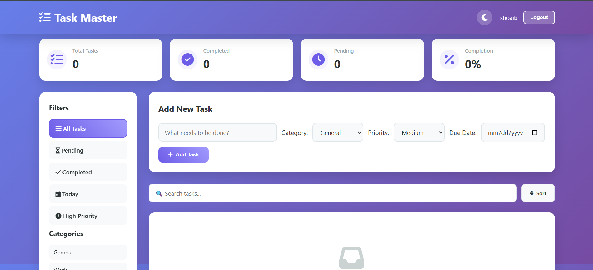

# 📋 Task Master - Advanced To Do List

> A modern, feature-rich task management web application built with vanilla JavaScript, HTML, and CSS.



## ✨ Features

### 🔐 **Authentication System**

- User registration with email and password validation
- Secure login/logout functionality
- Demo account for quick testing
- User session management

### 📊 **Dashboard & Analytics**

- Real-time task statistics
- Total tasks counter
- Completion tracking
- Progress percentage calculation
- Pending tasks visualization

### 🎯 **Task Management**

- Create, read, update, and delete tasks
- Mark tasks as complete/incomplete
- Task filtering (All, Active, Completed)
- Organize tasks by categories
- Priority levels for better organization

### 🎨 **User Experience**

- Clean and intuitive interface
- Responsive design for all devices
- Dark mode / Light mode toggle
- Smooth animations and transitions
- Font Awesome icons for visual appeal
- Modern color scheme

## 🚀 Getting Started

### Prerequisites

- Any modern web browser (Chrome, Firefox, Safari, Edge)
- No installation required!

### Installation

1. **Clone the repository**

```bash
git clone <repository-url>
cd ToDolist
```

2. **Open the application**

```bash
# Simply open the index.html file in your browser
```

Or use a local server:

```bash
# Using Python
python -m http.server 8000

# Using Node.js
npx http-server
```

3. **Access the application**

```
http://localhost:8000
```

## 🎮 How to Use

### **First Time Users**

1. Click on "Create Account" tab
2. Enter your details and register
3. Login with your credentials
4. Start managing your tasks!

### **Demo Mode**

- Click the "Try Demo" button to explore without registering

### **Adding Tasks**

1. Enter task description in the input field
2. Select priority level (optional)
3. Click the "Add" button
4. Your task appears in the task list

### **Managing Tasks**

- ✅ Check the checkbox to mark tasks as complete
- 📝 Edit tasks by clicking the edit button
- 🗑️ Delete tasks with the delete button
- 🔍 Use filters to view All, Active, or Completed tasks

### **Toggle Dark Mode**

- Click the moon icon in the header to switch between light and dark themes

## 🛠️ Project Structure

```
ToDolist/
├── index.html       # Main HTML structure
├── style.css        # Styling and responsive design
├── script.js        # JavaScript functionality
├── image.png        # Project preview image
├── LICENSE          # Project license
└── README.md        # Documentation (this file)
```

## 💻 Technologies Used

- **HTML5** - Semantic markup structure
- **CSS3** - Responsive styling with Flexbox & Grid
- **JavaScript (Vanilla)** - Dynamic functionality and DOM manipulation
- **Font Awesome** - Icon library for UI elements
- **Local Storage** - Client-side data persistence

## 🎓 Learning Outcomes

This project was created as a practice exercise in web development, demonstrating:

- DOM manipulation and event handling
- Local storage management
- Authentication flow design
- Responsive web design principles
- CSS animations and transitions
- JavaScript ES6+ features
- User interface/experience design

## 📱 Browser Compatibility

| Browser | Support    |
| ------- | ---------- |
| Chrome  | ✅ Full    |
| Firefox | ✅ Full    |
| Safari  | ✅ Full    |
| Edge    | ✅ Full    |
| IE 11   | ⚠️ Limited |

## 🎨 Customization

### Changing Colors

Edit the CSS variables in `style.css`:

```css
:root {
  --primary-color: #6366f1;
  --secondary-color: #ec4899;
  --background-color: #f8fafc;
  /* ... more variables */
}
```

### Adding New Features

- Extend `script.js` with new functions
- Update HTML structure in `index.html`
- Add styling in `style.css`

## 🤝 Contributing

Contributions are welcome! Feel free to:

1. Fork the repository
2. Create a feature branch (`git checkout -b feature/AmazingFeature`)
3. Commit your changes (`git commit -m 'Add AmazingFeature'`)
4. Push to the branch (`git push origin feature/AmazingFeature`)
5. Open a Pull Request

## 📝 License

This project is open source and available under the MIT License. See the [LICENSE](LICENSE) file for more details.

## 👨‍💻 Author

Created by **Shoaib Sikder** as a web development learning project.

## 🙏 Acknowledgments

- Font Awesome for beautiful icons
- Web development community for inspiration
- All users who provide feedback and suggestions

---

<div align="center">

### ⭐ If you find this project helpful, please give it a star!

**[Visit Repository](#)** • **[Report Bug](#)** • **[Request Feature](#)**

</div>
